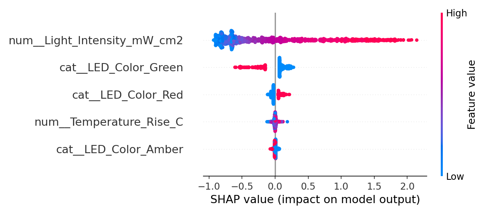
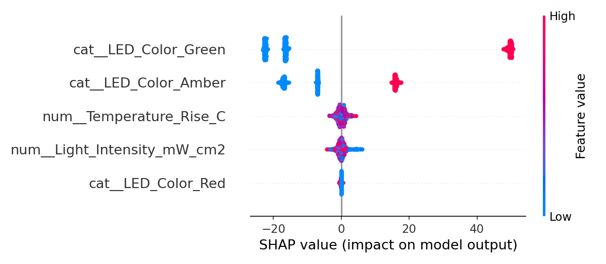
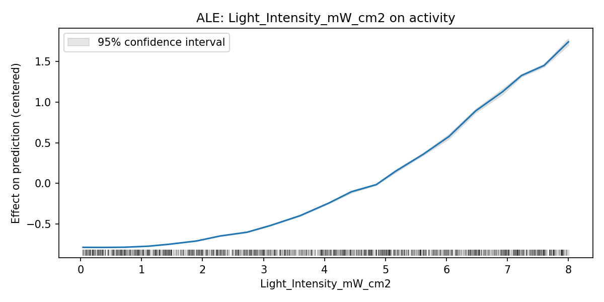
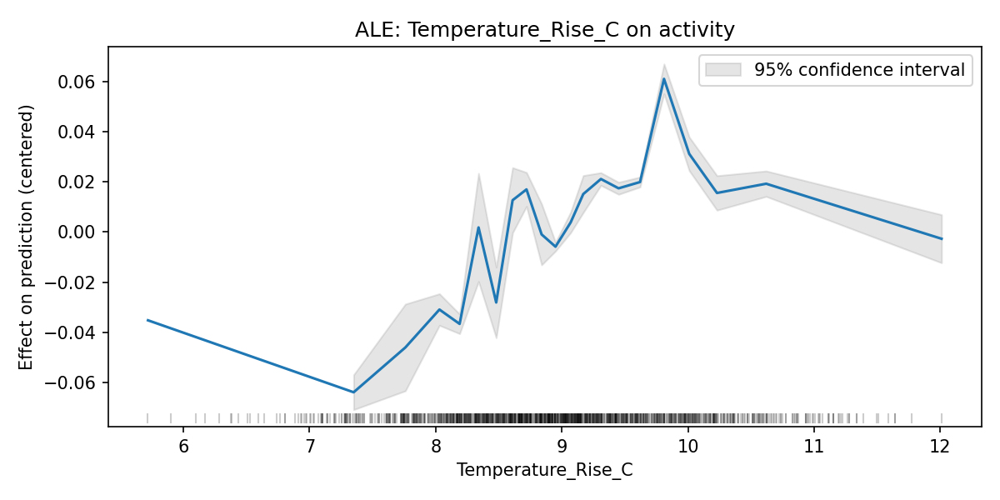
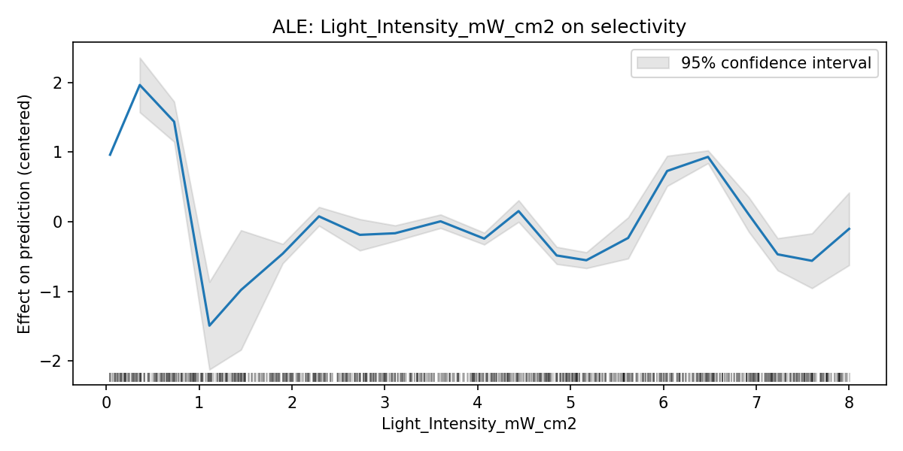
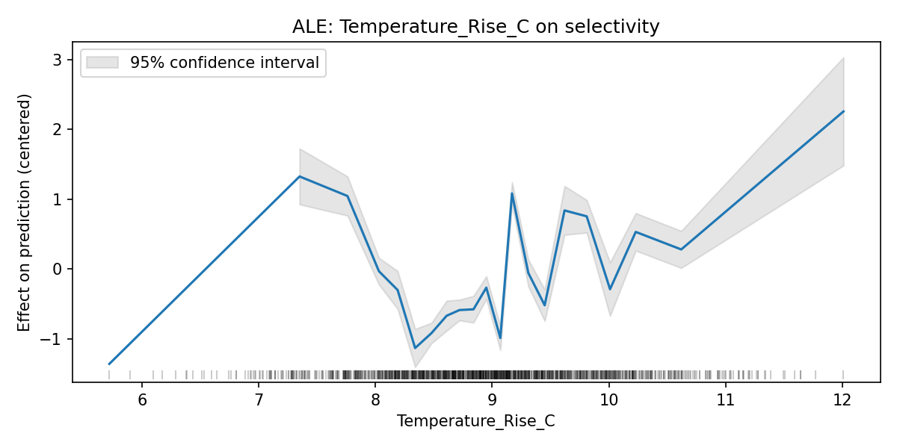

# ExplainableCatML

Stress-testing five explainability methods against a real, published photocatalysis mechanism — checking whether each method correctly separates the true chemical driver from a known experimental confound.

## Highlights

- Built a two-target Cu2O photocatalysis dataset calibrated to real measured data (Addanki Tirumala et al., *ACS Sustainable Chem. Eng.* 2023), not an invented relationship.
- Deliberately included a confound variable (light-induced temperature rise) with zero true effect on either target, mirroring the paper's own experimental control.
- Trained and compared three models (Random Forest, XGBoost, LightGBM) across two targets (activity, selectivity).
- Applied five explainability methods (SHAP, Permutation Importance, ALE, LIME, Counterfactual Search) to the same models and checked whether they agree with each other and with the known ground truth.
- A self-written counterfactual search independently rediscovered the paper's real experimental finding — that switching to green LED light alone drives selectivity from ~9% to ~98% — without being told the mechanism.
## Technical Skills Demonstrated

**Data Engineering & Literature Grounding**
- Extracted quantitative data directly from primary literature (PDF/SI parsing), including a 5-point dose-response table used to regress a power-law fit (`scipy.optimize.curve_fit`) rather than inventing a formula.
- Distinguished strongly-calibrated relationships (activity, backed by a full measured curve) from weakly-calibrated ones (selectivity, backed by a single anchor point) and documented that distinction explicitly rather than presenting both with false equal confidence.

**Machine Learning Engineering**
- Built a modular pipeline (`preprocessing.py` / `model.py` / `evaluation.py`) shared across three algorithms (Random Forest, XGBoost, LightGBM) and two prediction targets, avoiding duplicated training logic.
- Used `sklearn.Pipeline` + `ColumnTransformer` for consistent categorical/numeric preprocessing across all six model variants.
- Identified and fixed a two-target feature-leakage risk (`split_features_target` explicitly selecting feature columns rather than dropping one target, which would silently leave the other target in the training features).

**Explainable AI (XAI)**
- Applied five distinct explainability methods — SHAP (TreeExplainer), Permutation Importance, ALE, LIME, and a self-written counterfactual search — to the same fixed model, enabling direct method-to-method comparison rather than conflating model and method differences.
- Designed a deliberate confound variable (temperature) with zero true relationship to either target, then used it as a positive/negative control to test whether each XAI method correctly ruled it out — an experimental-science mindset applied to model interpretability.
- Correctly diagnosed *why* SHAP and Permutation Importance disagreed on a near-null feature (SHAP reflects trained-model behavior including overfit noise; Permutation reflects actual held-out generalization) rather than treating the disagreement as a bug.
- Wrote a transparent, dependency-free counterfactual search instead of a black-box library, prioritizing auditability — the search independently rediscovered a real published experimental conclusion (green LED → ~100% selectivity) without being told the mechanism.

**Software Engineering Practices**
- Wrote an automated `pytest` suite covering both data integrity (value ranges, missing data) and a specific regression test for the feature-leakage bug class described above.
- Managed version control through real-world friction (diverged branches, merge conflicts, dependency drift) rather than a clean linear history — including catching and fixing a stale `requirements.txt` before it caused a reproducibility failure.

**Scientific Reasoning**
- Synthesized five methods' outputs into a single cross-validation table, explicitly separating "all methods agree" findings from "methods disagree, here's why" findings — reporting calibrated uncertainty rather than cherry-picking the cleanest result.

## Scientific Basis

This dataset is scoped to Cu2O, based on:

Addanki Tirumala, R. T. et al. "Tuning Catalytic Activity and Selectivity in Photocatalysis on Mie-Resonant Cuprous Oxide Particles: Distinguishing Electromagnetic Field Enhancement Effect from the Heating Effect." *ACS Sustainable Chem. Eng.* 2023, 11, 15931-15940. https://doi.org/10.1021/acssuschemeng.3c04328

Two targets are modeled:

- **Activity** (MB conversion rate constant, hr⁻¹) — calibrated to Table S2 (SI), a real 5-point dose-response curve measured under red LED irradiation at varying intensity. A power-law fit (`k = k0 + a·I^n`) was regressed to these points. The paper's qualitative activity ordering by LED color (red > amber > green) is applied as an approximate scaling factor.
- **Selectivity** (% mineralization vs. oligomer product) — calibrated to a single precise anchor (green LEDs give ~100% mineralization selectivity, as reported). Red and amber values are approximate, interpolated only from the paper's stated qualitative ordering — not measured percentages. This is a weaker calibration than the activity relationship and is treated that way throughout, not overstated.

A third variable, **Temperature_Rise_C**, is a deliberate decoy. The paper's central experimental finding is that reaction temperature rises by a similar ~9°C regardless of light intensity or color — heating does not track with activity or selectivity. This dataset reproduces that decoupling intentionally, so the explainability methods below can be checked against a known-false hypothesis, not just a known-true one.

## Model Comparison

| Target | Model | R² | RMSE |
|---|---|---|---|
| Activity | Random Forest | 0.983 | 0.107 |
| Activity | XGBoost | 0.985 | 0.102 |
| Activity | LightGBM | 0.987 | 0.096 |
| Selectivity | Random Forest | 0.982 | 4.49 |
| Selectivity | XGBoost | 0.983 | 4.42 |
| Selectivity | LightGBM | 0.982 | 4.51 |

All six models score above R²=0.98. This is expected, not an achievement to overclaim: the synthetic data has a deliberately high signal-to-noise ratio (Selectivity in particular is close to a direct lookup on `LED_Color`), so near-perfect prediction confirms the generator worked as designed rather than demonstrating unusual modeling skill.

## Explainability Methods

Five methods were applied to a fixed XGBoost model per target, so differences reflect the explanation method, not the underlying model:

1. **SHAP** — global, per-sample feature attribution via TreeExplainer.
2. **Permutation Importance** — measures the actual drop in held-out R² when a feature is shuffled; operates on original (pre-encoding) columns.
3. **ALE (Accumulated Local Effects)** — designed to handle correlated/continuous features more reliably than partial dependence plots.
4. **LIME** — local, single-instance explanation, independent of the other four (global) methods.
5. **Counterfactual Search** — a self-written grid search (not a black-box library) finding the minimal change to a low-performing instance needed to cross a target threshold.

### SHAP Summary

### ALE

## Cross-Method Validation

| Feature | Target | SHAP | Permutation | ALE | LIME | Conclusion |
|---|---|---|---|---|---|---|
| Light_Intensity | Activity | Rank 1 | Rank 1 | Clean monotonic | Dominant, correct sign | All 4 agree — true primary driver |
| LED_Color | Activity | Rank 2 | Rank 2 | — | Secondary, correct sign | All agree — true secondary driver |
| Temperature_Rise_C | Activity | Rank 3 (near-zero) | Rank 3 (near-zero) | Flat/noisy | Near-zero | All 4 agree — decoy correctly ruled out |
| LED_Color | Selectivity | Rank 1 (42.4) | Rank 1 (1.93) | — | Dominant (-59) | All agree — true primary driver |
| Light_Intensity | Selectivity | Rank 3 | Rank 2 | Noisy, no trend | Small (+0.98) | Methods disagree on fine rank; all agree it's not a real driver |
| Temperature_Rise_C | Selectivity | Rank 2 | Rank 3 | Noisy, tail artifact | Small (+0.39) | Methods disagree on fine rank; all agree it's not a real driver |

**Key finding:** all methods correctly identify the true dominant driver for each target and correctly rule out the temperature confound as a major effect. Where they disagree — the precise rank of two near-null features — is itself informative: XAI methods are reliable on strong signal but can diverge in the low-signal regime, which is a real limitation worth knowing rather than hiding behind a single method's output.

**Counterfactual highlight:** given a low-selectivity instance (Red LED, 9.2%), the search found that switching to Green LED alone — with negligible change to intensity — raises predicted selectivity to 97.7%. This independently rediscovers the paper's actual experimental result without being told the mechanism.

## Repository Structure
ExplainableCatML
│
├── data
├── notebooks
├── src
├── models
│   ├── activity
│   └── selectivity
├── figures
├── results
├── tests
└── docs
## Project Goals

- Move beyond single-method explainability toward cross-method validation.
- Ground every synthetic relationship in real, cited experimental data, including honest treatment of weaker calibrations (selectivity) vs. stronger ones (activity).
- Deliberately include a known confound to test whether explainability methods can correctly rule it out, mirroring the actual experimental design of the source paper.
- Demonstrate that chemical intuition can be validated computationally, not just asserted.

## Current Status

Complete: dataset generation, three-model training, five explainability methods, cross-method validation, and an automated test suite checking both data integrity and a real regression (two-target feature leakage).

## About Me

I am a materials scientist working at the intersection of heterogeneous catalysis, photocatalysis, nanomaterials, and computational materials science. This repository is a companion to [CatalystML](https://github.com/teja2792/CatalystML), extending that work from prediction into explainability validation.
